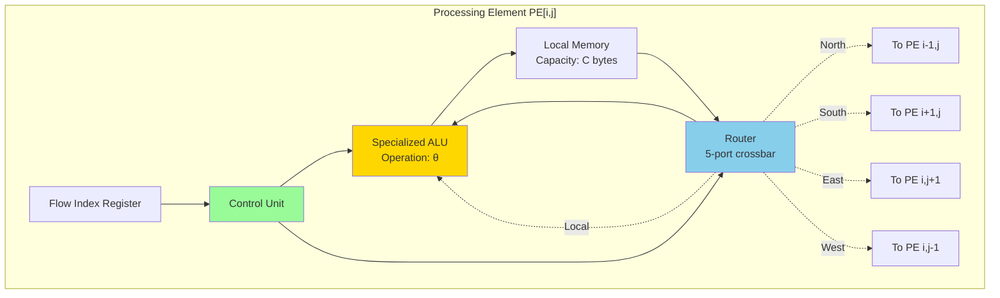
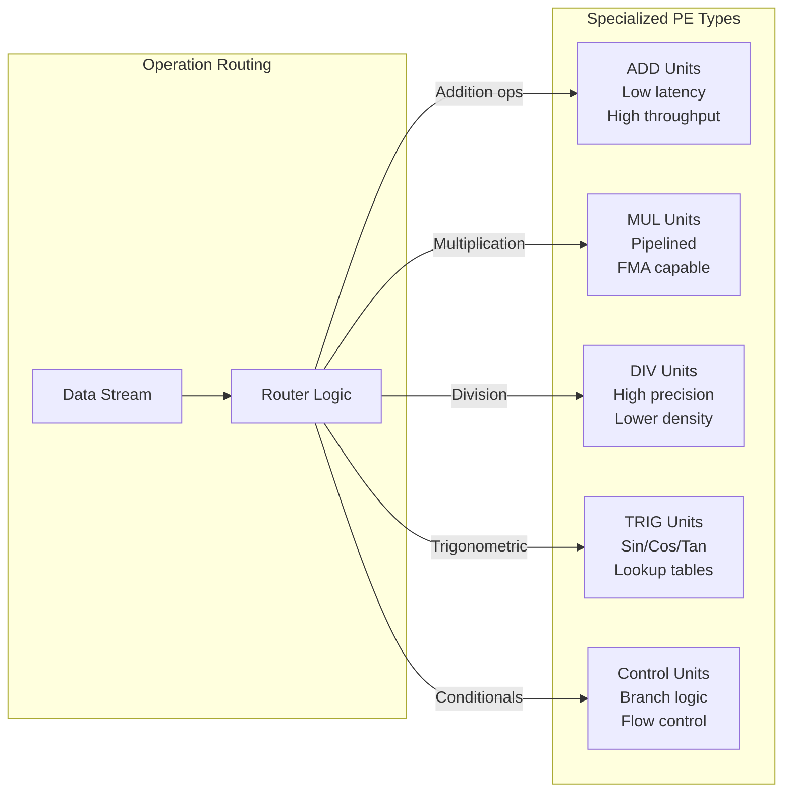
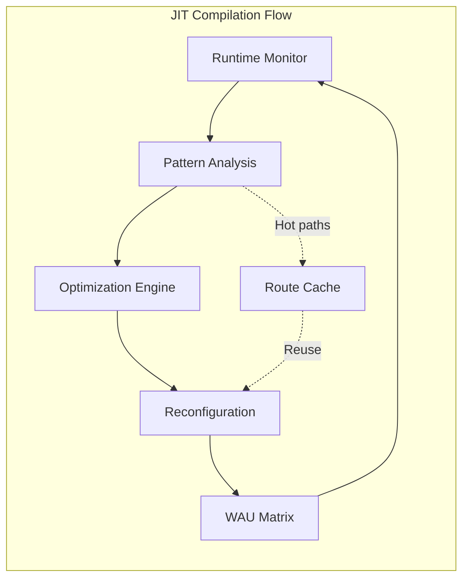
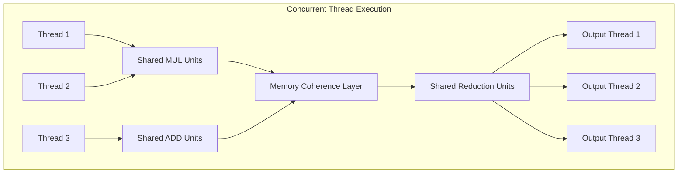
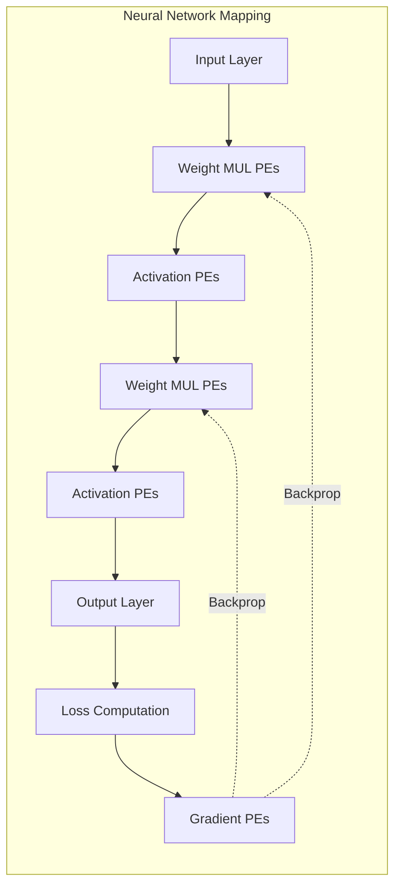
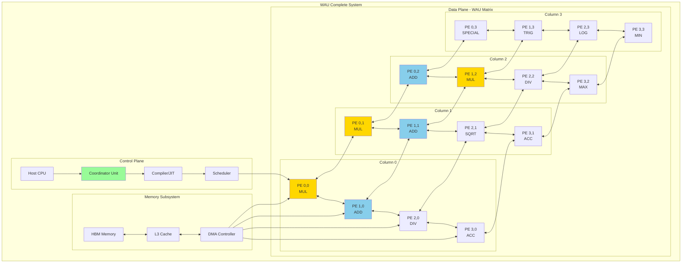
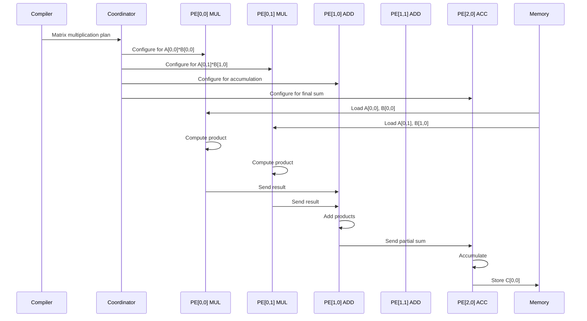

15 September 2025 - Version 2

Riccardo Cecchini - rcecchini.ds[at]gmail.com

# The Waterfall Arithmetic Unit: A Matrix Pipeline Architecture for High-Efficiency Parallel Processing

## Executive Summary

The Waterfall Arithmetic Unit (WAU) represents a paradigm shift in computational architecture, introducing a two-dimensional matrix of specialized arithmetic processing units interconnected through intelligent data highways. Unlike traditional von Neumann architectures, the WAU employs a deterministic dataflow approach where computation cascades through the matrix like water flowing through a structured channel system, hence the "waterfall" metaphor. This architecture achieves unprecedented efficiency in parallel arithmetic processing through specialized unit allocation, dynamic routing protocols, and compile-time optimization strategies.

## 1. Introduction and Motivation

### 1.1 The Computational Challenge

Modern computing faces an escalating challenge: the exponential growth in data-intensive applications outpaces the performance improvements of traditional processor architectures. The von Neumann bottleneck, power efficiency constraints, and the end of Dennard scaling necessitate revolutionary approaches to computational architecture.

The WAU addresses these challenges through:
- **Spatial Computing**: Distributing computation across a 2D matrix of processing elements
- **Specialized Processing**: Dedicating units to specific arithmetic operations for maximum efficiency
- **Dynamic Dataflow**: Enabling adaptive routing based on computational demands
- **Energy Efficiency**: Minimizing data movement through intelligent locality management

### 1.2 Core Innovation

The WAU's fundamental innovation lies in treating arithmetic computation as a flow problem rather than a sequential instruction problem. Data flows through a matrix of specialized units, each optimized for specific operations, creating a computational pipeline where multiple operations execute simultaneously on different data streams.

## 2. Architectural Foundation

### 2.1 Matrix Topology

The WAU consists of an $M \times N$ matrix of Processing Elements (PEs), where each element can be specialized for particular arithmetic operations:

$$\text{WAU} = \begin{bmatrix}
PE_{0,0} & PE_{0,1} & \cdots & PE_{0,N-1} \\
PE_{1,0} & PE_{1,1} & \cdots & PE_{1,N-1} \\
\vdots & \vdots & \ddots & \vdots \\
PE_{M-1,0} & PE_{M-1,1} & \cdots & PE_{M-1,N-1}
\end{bmatrix}$$

### 2.2 Processing Element Architecture

Each Processing Element contains:
- **Arithmetic Logic Unit (ALU)**: Specialized for specific operations (ADD, MUL, DIV, etc.)
- **Local Memory (LM)**: Fast SRAM for operand storage and intermediate results
- **Router (R)**: Intelligent routing unit for data forwarding
- **Control Unit (CU)**: Local control logic for operation scheduling
- **Flow Index Register (FIR)**: Maintains data state and routing information



### 2.3 Data Highway Infrastructure

The interconnection network consists of bidirectional data highways with varying bandwidth capacities:

- **Primary Highways**: High-bandwidth channels connecting adjacent PEs (128-bit width)
- **Express Lanes**: Skip connections for long-distance data transfer (256-bit width)
- **Vertical Cascades**: Optimized for downward data flow (waterfall pattern)
- **Horizontal Streams**: For lateral data distribution and collection

## 3. Operational Dynamics

### 3.1 Dataflow Model

The WAU implements a hybrid dataflow model combining static and dynamic elements:

**Static Dataflow**: Compile-time determined paths for predictable algorithms
$$\text{Path}_{static} = \{PE_{i_0,j_0} \rightarrow PE_{i_1,j_1} \rightarrow \cdots \rightarrow PE_{i_n,j_n}\}$$

**Dynamic Dataflow**: Runtime-adaptive routing for data-dependent operations
$$\text{Route}_{dynamic}(data, t) = f(\text{FIR}, \text{Congestion}, \text{Priority})$$

### 3.2 Specialized Unit Allocation

Different PEs specialize in specific arithmetic operations, creating an efficient division of labor:



### 3.3 Waterfall Execution Pattern

The waterfall pattern enables efficient pipelining of complex algorithms:

```mermaid
graph TD
    subgraph "WAU Matrix - Waterfall Pattern"
        subgraph "Row 0 - Input Stage"
            I0[Input PE 0,0<br/>Data Injection]
            I1[Input PE 0,1<br/>Data Injection]
            I2[Input PE 0,2<br/>Data Injection]
            I3[Input PE 0,3<br/>Data Injection]
        end
        
        subgraph "Row 1 - Stage 1 Processing"
            A0[MUL PE 1,0]
            A1[MUL PE 1,1]
            A2[ADD PE 1,2]
            A3[ADD PE 1,3]
        end
        
        subgraph "Row 2 - Stage 2 Processing"
            B0[ADD PE 2,0]
            B1[DIV PE 2,1]
            B2[MUL PE 2,2]
            B3[SQRT PE 2,3]
        end
        
        subgraph "Row 3 - Reduction Stage"
            C0[SUM PE 3,0]
            C1[SUM PE 3,1]
            C2[MAX PE 3,2]
            C3[MIN PE 3,3]
        end
        
        subgraph "Row 4 - Output Stage"
            O0[Output PE 4,0]
            O1[Output PE 4,1]
            O2[Output PE 4,2]
            O3[Output PE 4,3]
        end
        
        I0 ==>|data[0]| A0
        I1 ==>|data[1]| A1
        I2 ==>|data[2]| A2
        I3 ==>|data[3]| A3
        
        A0 ==>|result| B0
        A1 ==>|result| B1
        A2 ==>|result| B2
        A3 ==>|result| B3
        
        A0 -.->|bypass| B1
        A1 -.->|lateral| B2
        
        B0 ==>|flow| C0
        B1 ==>|flow| C1
        B2 ==>|flow| C2
        B3 ==>|flow| C3
        
        C0 ==>|final| O0
        C1 ==>|final| O1
        C2 ==>|final| O2
        C3 ==>|final| O3
    end
    
    style I0 fill:#90EE90
    style I1 fill:#90EE90
    style I2 fill:#90EE90
    style I3 fill:#90EE90
    style O0 fill:#FFB6C1
    style O1 fill:#FFB6C1
    style O2 fill:#FFB6C1
    style O3 fill:#FFB6C1
```

## 4. Compiler Architecture and Optimization

### 4.1 Compilation Pipeline

The WAU compiler performs sophisticated analysis and optimization:

1. **Algorithm Analysis**: Decompose computation into atomic operations
2. **Dependency Graph Construction**: Build data dependency DAG
3. **PE Allocation**: Map operations to specialized units
4. **Route Planning**: Determine optimal data paths
5. **Congestion Avoidance**: Implement anti-bouncing strategies
6. **Schedule Generation**: Create timing-aware execution plan

### 4.2 Anti-Bouncing Strategies

The compiler implements several strategies to prevent data bouncing:

**Static Reservation Protocol**:
$$\text{Reserve}(PE_{i,j}, t_{start}, t_{end}) = \begin{cases}
\text{Allocated} & \text{if available} \\
\text{Reroute} & \text{if occupied}
\end{cases}$$

**Flow Pressure Analysis**:
$$P_{flow}(i,j,t) = \sum_{k \in \text{neighbors}} \frac{\text{DataIn}_k(t)}{\text{Bandwidth}_{k \rightarrow (i,j)}}$$

### 4.3 Just-In-Time Adaptation

The JIT compiler component enables runtime optimization:



## 5. Concurrent Algorithm Support

### 5.1 Multi-Thread Execution

The WAU excels at executing multiple correlated threads sharing data dependencies:



### 5.2 Data Dependency Resolution

The architecture handles complex data dependencies through:

**Forward Propagation**: 
$$\text{Forward}(result_{PE_{i,j}}) \rightarrow \text{Consumer}_{PE_{m,n}}$$

**Synchronization Barriers**:
$$\text{Barrier}(t) = \bigwedge_{i \in \text{threads}} \text{Complete}_i(t)$$

## 6. Performance Characteristics

### 6.1 Throughput Analysis

The theoretical peak throughput for the WAU is:

$$T_{peak} = M \times N \times f_{clock} \times \text{OPS}_{per\_cycle}$$

Where:
- $M \times N$ = Total number of PEs
- $f_{clock}$ = Operating frequency
- $\text{OPS}_{per\_cycle}$ = Operations per cycle per PE

### 6.2 Energy Efficiency

Energy consumption follows:

$$E_{total} = E_{compute} + E_{communication} + E_{memory}$$

The WAU minimizes $E_{communication}$ through:
- Locality optimization
- Shortest path routing
- Data reuse strategies

### 6.3 Scalability Model

The architecture scales according to:

$$\text{Speedup}(n) = \frac{T_{sequential}}{T_{parallel}(n)} \approx \frac{n}{\alpha + \frac{1-\alpha}{n}}$$

Where $\alpha$ represents the inherently sequential portion of the algorithm.

## 7. Application Domains

### 7.1 Scientific Computing

**Matrix Operations**:
- Dense matrix multiplication: $O(n^3)$ operations parallelized across $O(n^2)$ PEs
- Sparse matrix computations with dynamic routing
- Linear algebra primitives (BLAS operations)

**Differential Equations**:
- Finite element methods with local stencil operations
- Computational fluid dynamics with neighbor communication patterns

### 7.2 Machine Learning Acceleration

**Neural Network Training**:


### 7.3 Signal Processing

**FFT Implementation**:
- Butterfly operations mapped to specialized PEs
- Bit-reversal through routing network
- Real-time processing with pipelined stages

## 8. Implementation Considerations

### 8.1 Physical Design

**Chip Layout**:
- 7nm process technology
- 2.5D packaging with HBM integration
- Thermal management through distributed hotspot avoidance

### 8.2 Programming Model

**High-Level API**:
```python
# Pseudo-code for WAU programming
wau = WAU.initialize(rows=16, cols=16)
wau.specialize({
    (0,0): "MUL",
    (0,1): "ADD",
    (1,0): "DIV",
    # ... PE specialization map
})

# Define computation graph
graph = ComputeGraph()
graph.add_operation("matmul", input_a, input_b)
graph.add_operation("relu", graph["matmul"])

# Compile and execute
compiled = wau.compile(graph, optimization_level=3)
result = compiled.execute(data)
```

## 9. Future Directions

### 9.1 Adaptive Specialization

Dynamic reconfiguration of PE specializations based on workload:
- Online learning of operation patterns
- Predictive specialization adjustment
- Power-aware reconfiguration

### 9.2 Heterogeneous Integration

Integration with other accelerators:
- CPU for control flow
- GPU for regular parallel workloads
- WAU for arithmetic-intensive irregular computations

### 9.3 Quantum-Classical Hybrid

Potential integration with quantum processing units:
- Classical pre/post-processing on WAU
- Quantum algorithm acceleration
- Error correction support

## 10. Conclusions

The Waterfall Arithmetic Unit represents a fundamental reimagining of computer architecture centered on **pipeline efficiency**. Starting from the simple 1D waterfall concept of data cascading through processing stages, the architecture scales elegantly to 2D matrix implementations and potentially to 3D stacked architectures using modern lithography techniques.

Key innovations include:

- **Pipeline-Centric Design**: Every architectural decision optimizes for continuous, stall-free pipeline operation
- **Checkerboard Specialization**: The alternating pattern of specialized units creates natural routing paths while balancing load distribution
- **Execution Time-Based Routing**: Dynamic path selection based on measured or predicted execution times ensures optimal throughput
- **Scalable Dimensionality**: From 1D pipelines to 2D matrices to 3D stacked architectures, maintaining the waterfall flow paradigm
- **FPGA Prototyping Path**: Enables rapid iteration and validation of specialization patterns before ASIC commitment
- **Low-Level Kernel Control**: Direct programming model similar to Vulkan/Metal but enhanced for pipeline flow management

The checkerboard pattern of specialized arithmetic units, combined with execution timing awareness, creates a unique computational substrate where:
- Pipeline efficiency approaches theoretical maximum
- Multiple algorithm flows execute concurrently without interference
- Runtime profiling continuously optimizes routing decisions
- Power efficiency emerges from minimized data movement

The architecture's evolution from 1D to potentially 3D implementations demonstrates its fundamental soundness. FPGA-based development allows researchers to explore optimal checkerboard configurations, validate timing models, and refine routing algorithms before committing to silicon.

The WAU's focus on pipeline efficiency, rather than raw computational density, positions it as an ideal accelerator for the modern era where data movement costs dominate energy consumption and performance bottlenecks. By treating computation as a carefully orchestrated flow through specialized processing stages, the WAU achieves what traditional architectures cannot: near-perfect pipeline utilization with minimal control overhead.

Future developments will likely focus on:
- **Adaptive Checkerboard Patterns**: Runtime reconfiguration based on workload characteristics
- **3D Integration**: Exploiting vertical dimension for even greater specialization
- **Heterogeneous Integration**: WAU as a pipeline-efficient accelerator alongside traditional processors
- **Application-Specific Variants**: Customized checkerboard patterns for specific domains

The Waterfall Arithmetic Unit thus represents not just an incremental improvement, but a fundamental rethinking of how arithmetic computation should flow through silicon - like water finding its most efficient path downward, guided by the architecture's carefully designed channels.

---

## References

- Cecchini, R. (2024). "The Waterfall Arithmetic Unit: A High-Efficiency Parallel Processing Architecture"
- Original concept: rcecchini.ds@gmail.com
- Extended analysis and architectural enhancements

## Appendix: Detailed Mermaid Diagrams

### A.1 Complete WAU System Architecture



### A.2 Data Flow Example - Matrix Multiplication



---

*This enhanced document presents the Waterfall Arithmetic Unit as a revolutionary approach to parallel computing, combining theoretical rigor with practical implementation considerations.*