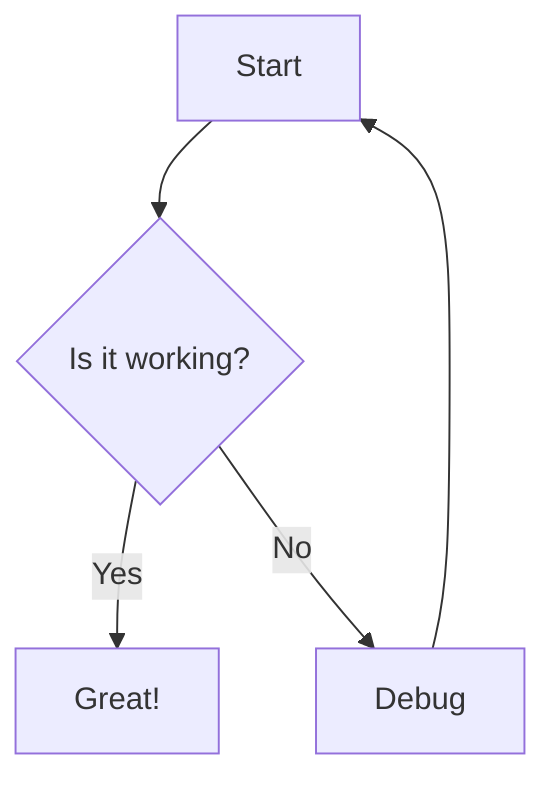
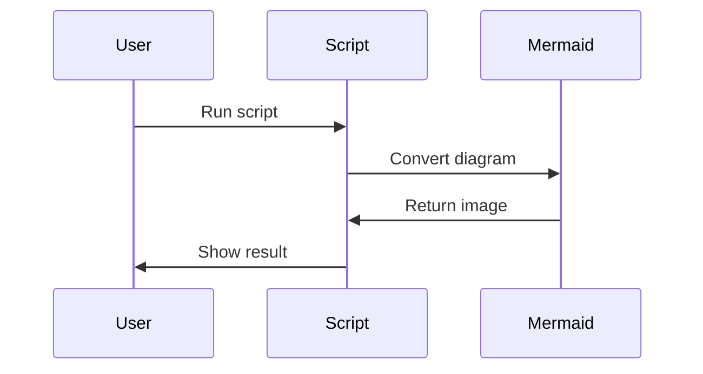

# Test Markdown File

This is a test file with Mermaid diagrams and LaTeX expressions.

## Mermaid Diagram

## LaTeX Math

Here's an inline equation: $E = mc^2$

And a display equation:

$$\int_{a}^{b} f(x) dx = F(b) - F(a)$$

## Another Mermaid Diagram

The quadratic formula: $x = \frac{-b \pm \sqrt{b^2 - 4ac}}{2a}$
